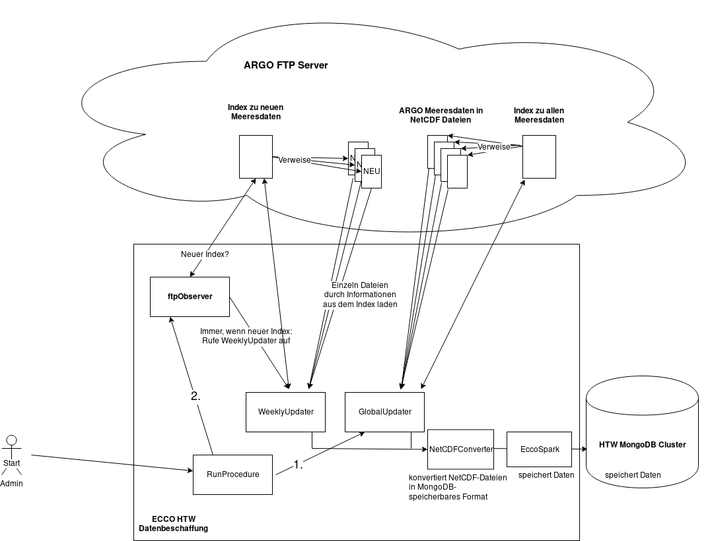

# Allgemeine Infos zum Projekt (unabhängig von den Einzelprojekten)

[siehe hier](https://github.com/ecco-htw/Datenverarbeitung/blob/master/README.md)

# Daten-Management im Rahmen des HTW ECCO Projektstudiums

Scala Spark Programm zur Datenbeschaffung und Datenspeicherung

## Vorraussetzung
### IDE
* Für Eclipse `sbt eclipse`, Projekt import und die Properties wie im Bild setzen:
  
* Für IntelliJ import als sbt Projekt

### Umgebungsvariablen
Damit das Programm laufen kann sind Authentifizierungsdaten notwendig, diese werden
über Umgebungsvariablen in das Programm gelesen. Die benötigten Umgebungsvariablen
sind die Folgenden:

* MONGO_HOST
* MONGO_PORT
* MONGO_USER
* MONGO_PASSWORD
* MONGO_DB
* MONGO_COLLECTION

Die Umgebungsvariablen werden auf dem Server über `/home/local/.profile` gesetzt. Wird sie angepasst, sollte der Server neu gestartet werden.

## Programm starten
Vor dem Starten: Bitte siehe Kapitel *Vorraussetzung*.

### auf dem Server
```
sbt run
```

### lokal
```
$ ssh -L 127.0.0.1:27020:hadoop05.f4.htw-berlin.de:27020 local@ecco.f4.htw-berlin.de
```
In anderem Terminal:
Lokal Environment-Variablen setzen wie in `/home/local/.profile` auf dem Server, nur mit `MONGO_HOST=localhost`
```
sbt run
```

## Dokumentation
Der Quelltext wurde nach den [Scala Doc Konventionen](https://docs.scala-lang.org/style/scaladoc.html) geschrieben.
Die Kommentare können entweder in den jeweiligen Scala Dateien selbst gelesen werden,
oder es kann mit dem Befehl `sbt doc` die Dokumentation im HTML-Format exportiert werden
und im Browser durch das Öffnen der Datei *target/scala-2.11/api/index.html* angezeigt werden.

## Architektur
Das Programm ist in fünf 'Packages' gegliedert mit jeweils einer Scala-Datei. Zu jeder Scala-Datei wird im Folgenden die zugehörige Funktion innerhalb des Programms beschrieben um einen Überblick
über die Komponenten zu erhalten.

### Skizze
Die Zeichnung ist mit draw.io erstellt worden und visualisiert die Abläufe des Programms.
Die Zeichnung kann durch importieren der zur Verfügung gestellten ECCO-Datenbeschaffung-Skizze.xml
Datei in draw.io überarbeitet werden.


### eccoutil/ArgoFloatException.scala
Die Datei 'ArgoFloatException' enthält wie der Name bereits andeutet eine eigene Exception um
dem Nutzer des Programms ggf. eine sinnvolle Fehlermeldung zurückzugeben.

### main/RunProcedure.scala
In 'RunProcedure' befindet sich das Object mit der *main*-Methode um das Programm zu starten.
Wird das Programm gestartet, würd zunnächst ein "Global Update" durchgeführt. Es wird ein Objekt der Klasse "Global Updater" verwendet, um den Stand der Datenbank mit dem des FTP-Servers abzugleichen und alle in der DB fehlenden Einträge in dieser zu speichern (*globalUpdater.update()*).

Nachdem das "Global Update" erfolgreich ausgeführt wurde, geht das Programm unter Verwendung des Ftp-Observers in einen Status über, in dem es in regelmäßigen Abständen nach einer neuen "Weekly List" vom FTP-Server fragt. 

Existiert diese wird sie automatisch durch die Callback-Methode des Observers (*doWeeklyUpdate*) mithilfe eines Objekts der Klasse *WeeklyUpdater* heruntergeladen und ihre Inhalte in der DB gespeichert. 

### preprocessing/IndexFile.scala
Diese Klasse repräsentiert eine Index Datei (GlobalList/WeeklyList) des FTP-Servers. Ihre Hauptaufgabe ist es die Einträge der Index Datei auf Objekte der Case-Klasse *IndexFileEntry* abzubilden. Die für uns relevanten und letzendlich in der Case-Class gespeicherten Felder eines Eintrages sind "dateUpdate" (*date*) und der Subpfad der dazugehörigen NetCDF-Datei (*path*). <br/>
Andere Module können über das Feld *data* (ein Spark-RDD) auf die IndexFileEntry-Objekte zugreifen.
### preprocessing/GlobalUpdater.scala
GlobalUpdater lädt die NetCDF Dateien, deren Pfade in einem IndexFile Objekt hinterlegt sind, in ein Spark RDD und nutzt dann ein Objekt der Klasse NetCDFConverter um relevante Daten aus diesen zu extrahieren und in der Datenbank zu speichern. <br/>
Die Klasse ist auf Index-Files vom Typ GlobalIndex ausgerichtet.<br/>
(ftp://ftp.ifremer.fr/ifremer/argo/ -> ar_index_global_prof.txt) <br/> 
Soll ein WeeklyIndex gehandhabt werden, sollte die Klasse WeeklyUpdater verwendet werden. 


Die Methode *update* sortiert zu Beginn die Einträge des GlobalIndex nach derem "date"-Attribut. Anschließend ruft sie die Methode *processBucket(progress:Date)* auf, in welcher ein Teil ("Bucket") der Datenmenge abgearbeitet wird.<br/>
Ist ein solcher Teilprozess erfolgreich abgeschlossen, wird das *date*-Feld des letzten Eintrags des Buckets in einer Collection/Table der Datenbank gespeichert. <br/> Anschließend ruft sich *processBucket* rekursiv auf und übergibt das zuletzt abgearbeitete Datum, welches als Startposition im sortierten GlobalIndex des nächsten Buckets verwendet wird. 


Dieses Vorgehen ermöglicht es, im Falle eines vorzeitigem Beenden des Update-Prozesses, nicht wieder am Anfang des GlobalIndex mit dem Abarbeiten beginnen zu müssen. Stattdessen fragt die *update*-Methode das zuletzt gespeicherte Datum aus der Datenbank ab und übergibt dies an *processBucket*.

### preprocessing/WeeklyUpdater.scala
WeeklyUpdater lädt die NetCDF Dateien, deren Pfade in einem IndexFile Objekt hinterlegt sind, in ein Spark RDD und nutzt dann ein Objekt der Klasse NetCDFConverter um relevante Daten aus diesen zu extrahieren und in der Datenbank zu speichern.<br/>
Die Klasse ist auf Index-Files vom Typ WeeklyIndex ausgerichtet.<br/>
(ftp://ftp.ifremer.fr/ifremer/argo/ -> ar_index_this_week_prof.txt) <br/>
Soll ein GlobalIndex gehandhabt werden, sollte die Klasse GlobalUpdater verwendet werden. 

### EccoSpark.scala
EccoSpark ist ein Global verfügbares Objekt, welches von anderen Klassen verwendet wird, um Argo-Daten aus der Datenbank zu erhalten oder in ihr zu speichern.
In EccoSpark werden alle nötigen Einstellungen bezüglich der Datenbank konfiguriert.

### netcdfhandling/NetCDFConverter.scala
### netcdfhandling/Package.scala

### observer/FtpObserver.scala
//Stimmt noch <br/>
Die FtpObserver Klasse ist als Akka actor implementiert. Damit entspricht jede
Instanz der Klasse einem Worker Thread. Wir benötigen für unseren Anwendungsfall
nur einen Worker Thread.

Die Aufgabe dieser Klasse ist es den FTP Server periodisch (bisher ein mal täglich) nach Veränderungen der Index Datei abzufragen. Wenn eine Änderung erkannt wurde, dann wird eine
Callback-Methode aufgerufen die beim erstellen einer Instanz der Klasse übergeben werden kann.

Akka actors kommunizieren über Nachrichten, dafür müssen die Nachrichten die empfangen werden können zuvor definiert werden. Der FtpObserver definiert drei Nachrichten:
* **Start:** Dies startet den Initialisierungsprozess und setzt einen Akka timer mit dem der actor sich selbst die Polling Nachricht in einem bestimmten Zeitintervall (einen Tag) übermittelt
* **Polling:** Startet eine Anfrage an den FTP Server ob der Index sich verändert hat
* **Stop:** Dies beendet den Actor (Wird momentan nicht genutzt, da der Downloader langfristig laufen soll)

## Hilfreiche Links
* [Argo DOI](http://www.argodatamgt.org/Access-to-data/Argo-DOI-Digital-Object-Identifier)
* Argo Data FTP: ftp://ftp.ifremer.fr/ifremer/argo
* [SciSpark-API](https://scispark.jpl.nasa.gov/api/)
* [Java-NetCDF-API](https://www.unidata.ucar.edu/software/thredds/v4.3/netcdf-java/v4.3/javadoc/index.html)
* [Apache Zeppelin](https://zeppelin.apache.org/)

## Am Anfang empfohlen
Mittels notebooks von Apache Zeppelin Daten explorieren, weil geringer Konfigurationsaufwand.
Importiere die Notebooks vom Ordner Zeppelin-Notebooks um loszulegen.

## Troubleshooting
* Fragen an [Slack-Gruppe](https://htw-ai-wise-2016.slack.com)
* Bei gelösten Problemen bitte *ReadMe.md* erweitern
